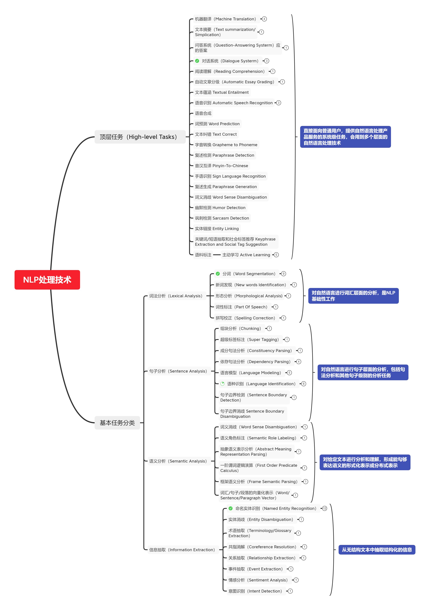
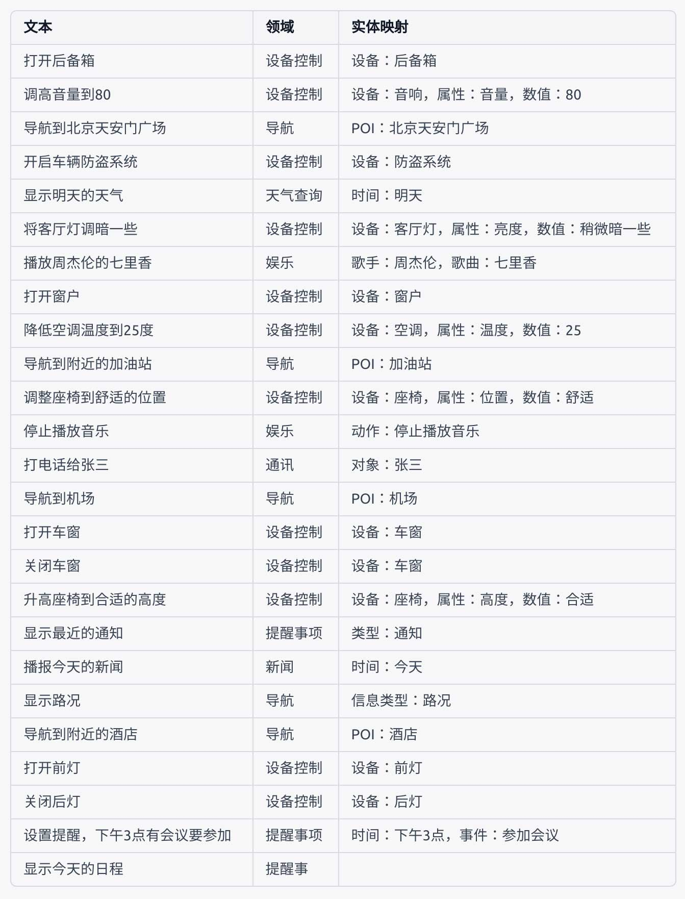

# 使用 Prompts 和 Chains 让 ChatGPT 成为神奇的生产力工具！

每日持续更新中～

ChatGPT 诞生后，因其非常强大的又难以置信的的能力，得到了非常广泛的关注。用户将 ChatGPT 视作一种有趣且知识渊博的聊天工具。但事实上，使用合适的 Prompts 和 Chains，可以将 ChatGPT 作为一个神奇的生产力工具，能够处理各种各样复杂的任务。本仓库将详细介绍如何使用 ChatGPT 完成各种任务。

**One more thing**: 作者作为谷歌机器学习开发者专家（Google Developer Experts in Machine Leaning），即将拿到 Google Bard 模型的内部试用资格。后续将会把 Google Bard 相关的评测和使用指南也更新到这个仓库。敬请期待～

欢迎在 Github 上关注（follow）[作者](https://github.com/howl-anderson)，点赞（star）[这个项目](https://github.com/howl-anderson/unlocking-the-power-of-llms)！您的支持是作者持续研究的最大动力！

## 计划

我们计划使用 ChatGPT （也将包含 Google Bard）完成各种 NLP 任务和一些非 NLP 任务。

将要讨论的 NLP 任务如下图所示：



## 文本润色与改错

这一任务通常使用 Grammarly 等工具来完成，但事实上 ChatGPT 是可以作为一个更加强大的文本润色和改错工具的！

下面，我们将展示如何使用 ChatGPT 润色一段文本：

```markdown
润色下面这段话，修正其中的语法错误，使用正式的文风：
机器学习正式一个好的工具啊，他啥都做，比如他可以帮我修一修语法和拼写地错误。
```

那么我们将得到如下的结果：

```markdown
机器学习是一个非常好的工具，它可以胜任各种任务。例如，它可以帮助我修正语法和拼写错误。
```

怎么样？是不是很神奇？！

在实际使用中，你可以要求 ChatGPT 润色或者改写成符合你使用场景的文本风格。比如，我们可以这么问：

```
润色下面这段话，将其改写成文章的标题：
机器学习正式一个好的工具啊，他啥都做，比如他可以帮我修一修语法和拼写地错误。
```

这样，我们就可以得到想要的结果：

```
"机器学习：修正语法和拼写错误的好工具"
```

## 文本翻译

这一任务通常使用 Google Translator 和 DeepL 这样的工具来完成，使用 ChatGPT 同样可以做到。

下面我们将展示如何使用 ChatGPT 翻译一段文本：

```markdown
翻译下面这段话：
Knowledge is power! And it exists in the ChatGPT!
```

那么我们将得到如下的结果：

```
知识就是力量！而这种力量存在于ChatGPT中！
```

# NLU 开发

除了上面这些比较通用的文本任务，我们还能对 ChatGPT 进行 finetune，让其阅读我们的数据，理解我们的业务逻辑，从而可以成为一个骨干员工级别的生产力助手。

下面我们将按照场景进行细分说明。

## NLU 语料扩充

语料扩充是开发对话机器人中非常消耗时间和人力的工作。有了 ChatGPT 之后，我们就可以让 ChatGPT 理解我们现有的语料，然后帮我们扩充。

假设我们现有的语料是这样的：

| 文本           | 领域     | 实体映射      |
| -------------- | -------- | ------------- |
| 打开车门       | 设备控制 | 设备：车门    |
| 关闭空调       | 设备控制 | 设备：空调    |
| 导航到人民路   | 导航     | POI：人民路   |
| 开车去郊野公园 | 导航     | POI：郊野公园 |

你可能会好奇，ChatGPT 作为一个基于文本的机器人，它怎么才能读取表格信息呢？事实上，ChatGPT 比我们想象中的要更加聪明。比如，你可以给他 Markdown 格式的表格数据，比如，上面这个表格的 Markdown 表示是这样的：

```
| 文本           | 领域     | 实体映射      |
| -------------- | -------- | ------------- |
| 打开车门       | 设备控制 | 设备：车门    |
| 关闭空调       | 设备控制 | 设备：空调    |
| 导航到人民路   | 导航     | POI：人民路   |
| 开车去郊野公园 | 导航     | POI：郊野公园 |
```

甚至你可以直接从 Excel 中复制数据粘贴到文本框中，这时表格的表示形式是：每个单元格都用空格隔开。同样用上面的表格数据举例，我们可以得到如下的表格数据表示：

```
文本	领域	实体映射
打开车门	设备控制	设备：车门
关闭空调	设备控制	设备：空调
导航到人民路	导航	POI：人民路
开车去郊野公园	导航	POI：郊野公园
```

但我们并不推荐使用后者这种做法，原因有：

- 这个格式使用空白作为分割符号，在表格数据包含空格的情况下（比如有英文段落），将会存在理解上的歧义。
- 空白分割后的数据，不利于人类进行阅读。
- 默认情况下，ChatGPT 会使用相同的格式进行输出，因此在将 ChatGPT 的结果解析成表格数据时就会存在困难和歧义。

在学习了 ChatGPT 如何阅读表格后，下面我们将展示如何使用 ChatGPT 基于这些语料进行扩充：

```
你是一个自然语言处理的语料增强程序，请理解并增强下面这个的语料，不要过度泛化：
| 文本           | 领域     | 实体映射      |
| -------------- | -------- | ------------- |
| 打开车门       | 设备控制 | 设备：车门    |
| 关闭空调       | 设备控制 | 设备：空调    |
| 导航到人民路   | 导航     | POI：人民路   |
| 开车去郊野公园 | 导航     | POI：郊野公园 |
```

我们将得到如下的结果：



是的，我没搞错，你也没看错，这次 ChatGPT 给出的不是文本，而是表格！事实上，ChatGPT 作为一个基于文本的对话机器人当然是没有能力直接生成表格这样的非文本产物的。那么这里为什么会显示成表格呢？那是因为 ChatGPT 输出的是 markdown 格式的表格信息，ChatGPT 网页将 markdown 信息进行了渲染，因此用户看到的将是渲染后的表格。ChatGPT 实际输出的文本是这样的：

```markdown
| 文本                          | 领域     | 实体映射                                   |
| ----------------------------- | -------- | ------------------------------------------ |
| 打开后备箱                    | 设备控制 | 设备：后备箱                               |
| 调高音量到80                  | 设备控制 | 设备：音响，属性：音量，数值：80           |
| 导航到北京天安门广场          | 导航     | POI：北京天安门广场                        |
| 开启车辆防盗系统              | 设备控制 | 设备：防盗系统                             |
| 显示明天的天气                | 天气查询 | 时间：明天                                 |
| 将客厅灯调暗一些              | 设备控制 | 设备：客厅灯，属性：亮度，数值：稍微暗一些 |
| 播放周杰伦的七里香            | 娱乐     | 歌手：周杰伦，歌曲：七里香                 |
| 打开窗户                      | 设备控制 | 设备：窗户                                 |
| 降低空调温度到25度            | 设备控制 | 设备：空调，属性：温度，数值：25           |
| 导航到附近的加油站            | 导航     | POI：加油站                                |
| 调整座椅到舒适的位置          | 设备控制 | 设备：座椅，属性：位置，数值：舒适         |
| 停止播放音乐                  | 娱乐     | 动作：停止播放音乐                         |
| 打电话给张三                  | 通讯     | 对象：张三                                 |
| 导航到机场                    | 导航     | POI：机场                                  |
| 打开车窗                      | 设备控制 | 设备：车窗                                 |
| 关闭车窗                      | 设备控制 | 设备：车窗                                 |
| 升高座椅到合适的高度          | 设备控制 | 设备：座椅，属性：高度，数值：合适         |
| 显示最近的通知                | 提醒事项 | 类型：通知                                 |
| 播报今天的新闻                | 新闻     | 时间：今天                                 |
| 显示路况                      | 导航     | 信息类型：路况                             |
| 导航到附近的酒店              | 导航     | POI：酒店                                  |
| 打开前灯                      | 设备控制 | 设备：前灯                                 |
| 关闭后灯                      | 设备控制 | 设备：后灯                                 |
| 设置提醒，下午3点有会议要参加 | 提醒事项 | 时间：下午3点，事件：参加会议              |
| 显示今天的日程                | 提醒事   |                                            |
```

值得一提的是，ChatGPT 输出的 markdown 内容由网页客户端进行渲染，也是为什么 ChatGPT 输出的代码会有高亮等非文本特性的原因。

你也许会问另一个实际的问题，那就是每次 ChatGPT 只能回答一个相对较短的答案，那么我如何才能让它帮我生成大量的语料呢？答案就是Chains，也就是继续问 ChatGPT。在我们当前的例子中，我们可以这样和 ChatGPT 说：

```
继续生成
```

那么 ChatGPT 在收到我们的指令后，会继续生成扩充的语料，如下图所示：

| 文本                            | 领域     | 实体映射                                     |
| ------------------------------- | -------- | -------------------------------------------- |
| 打开行李箱                      | 设备控制 | 设备：行李箱                                 |
| 调整窗帘至适宜的高度            | 设备控制 | 设备：窗帘，属性：高度，数值：适宜           |
| 导航到最近的医院                | 导航     | POI：医院                                    |
| 播放薛之谦的歌曲                | 娱乐     | 歌手：薛之谦                                 |
| 打开车载空气净化器              | 设备控制 | 设备：车载空气净化器                         |
| 关闭车载空气净化器              | 设备控制 | 设备：车载空气净化器                         |
| 调高车座温至适宜的温度          | 设备控制 | 设备：车座，属性：温度，数值：适宜           |
| 导航到家                        | 导航     | POI：家                                      |
| 打开车顶天窗                    | 设备控制 | 设备：车顶天窗                               |
| 关闭车顶天窗                    | 设备控制 | 设备：车顶天窗                               |
| 显示今天的股票行情              | 财经     | 时间：今天，信息类型：股票行情               |
| 拨打紧急电话                    | 通讯     | 动作：拨打紧急电话                           |
| 导航到最近的超市                | 导航     | POI：超市                                    |
| 调整空调风向至面部              | 设备控制 | 设备：空调，属性：风向，数值：面部           |
| 打开后备箱盖                    | 设备控制 | 设备：后备箱盖                               |
| 关闭后备箱盖                    | 设备控制 | 设备：后备箱盖                               |
| 调高车载音响的低音              | 设备控制 | 设备：车载音响，属性：低音，数值：稍微高一些 |
| 播报明天的天气                  | 天气查询 | 时间：明天                                   |
| 显示附近的停车场信息            | 导航     | POI：停车场，信息类型：附近                  |
| 导航到最近的药店                | 导航     | POI：药店                                    |
| 打开车载导航声音                | 设备控制 | 设备：车载导航，属性：声音，数值：打开       |
| 关闭车载导航声音                | 设备控制 | 设备：车载导航，属性：声音，数值：关闭       |
| 设置提醒，每周一下午4点有英语课 |          |                                              |

用户你不断的重复上面的指令就可以源源不断的得到扩充的语料了。怎么样，是不是特别的神奇又实用？！

## NLU 语料清洗

TODO: 这个在实际工作中非常重要，今天实在忙不过来了，明天更新～

## NLU 推理

TODO: 这是一个庞大且复杂的话题，今天实在忙不过来了，明天更新～

## ChatGPT 输出图像

你知道么？ChatGPT 是能够输出图像的！（想不到吧～

TODO: 今天实在忙不过来了，明天更新～

## 想要更多 ChatGPT 的神奇用法？

没问题！更多内容已经在策划中了，欢迎在 Github 上关注（follow）[作者](https://github.com/howl-anderson)，点赞（star）[这个项目](https://github.com/howl-anderson/unlocking-the-power-of-llms)！您的支持是作者持续研究的最大动力！
